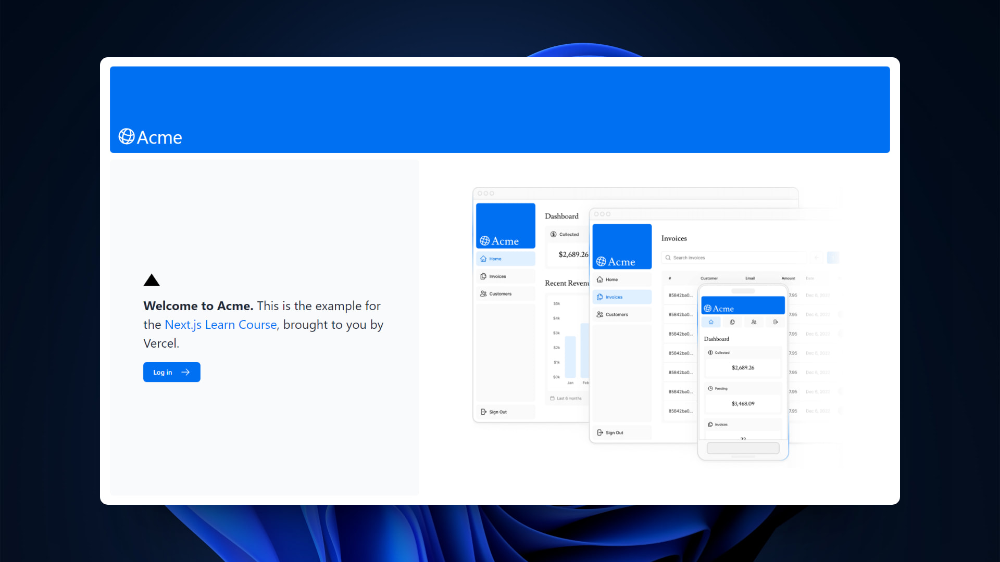

# 🔺 Next.js App Router Course - Starter

### Dashboard del curso de Next.js 14

> 🧩 Aquí puedes ver su [**Live Demo.**](https://next14-learning-course-6hmqw7cv6-abrahamgalues-projects.vercel.app/)

## 🚀 Descripción

Esta es la aplicación creada al completar el curso oficial de [**Next.js.**](https://nextjs.org/learn)

Este proyecto contiene las últimas funcionalidades de Next.js 14 [**liberadas el 26 de Octubre de 2023.**](https://nextjs.org/blog/next-14)

## 🎭 Tecnologías

El proyecto utiliza las siguientes tecnologías:

- [**Tailwind CSS**](https://tailwindcss.com/) para aplicar los estilos.
- Optimización de [**fuentes**](https://nextjs.org/docs/app/building-your-application/optimizing/fonts) e [**imágenes.**](https://nextjs.org/docs/app/building-your-application/optimizing/images)
- Base de datos con [**postgres.**](https://vercel.com/docs/storage/vercel-postgres/sdk)
- [**Streaming**](https://nextjs.org/docs/app/building-your-application/routing/loading-ui-and-streaming) de la UI de usuario.
- [**Server Actions**](https://nextjs.org/docs/app/building-your-application/data-fetching/server-actions-and-mutations) para la manipulación de los datos.
- Manejo de [**errores.**](https://nextjs.org/docs/app/building-your-application/routing/error-handling)
- Autenticación de usuario con [**NextAuth.js**](https://authjs.dev/reference/nextjs) para acceder a las rutas.
- Protección de las rutas usando [**Next Middleware.**](https://nextjs.org/docs/app/building-your-application/routing/middleware)
